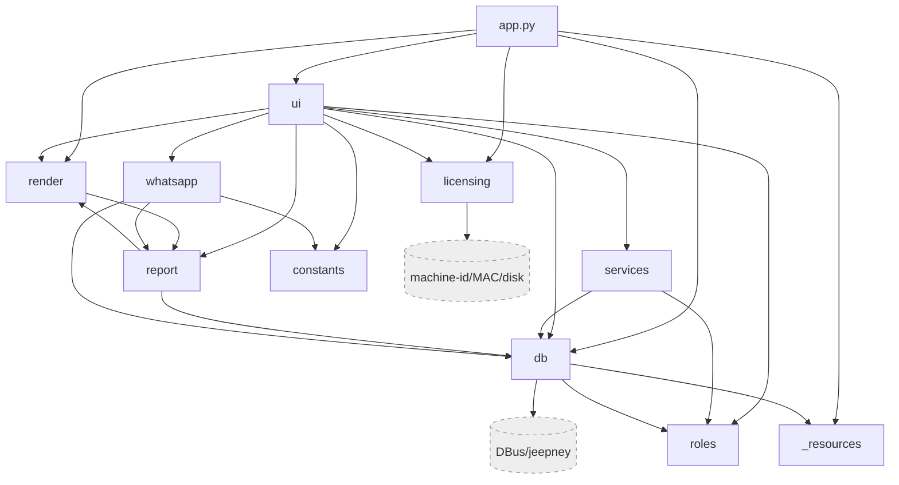

# 03 — Dependency / Import Graph

Built programmatically with `ast` over every module in `src/labdesk` (relative imports resolved to fully-qualified module names; submodule-style `from ..pkg import mod` resolved to the submodule). Edges are **module-level** imports.

---

## 1. Package-level dependency graph (mermaid)



**Direction is clean and acyclic at the package level** except `report ⇄ render` (intentional, see §3). Dependency arrows always point downward (UI → services → report/render → db → base). No layer is imported by a layer below it except the documented render/report pair.

---

## 2. Full module import graph (text)

```
labdesk                       -> (none)
labdesk.__main__              -> labdesk.app
labdesk._resources            -> labdesk
labdesk.app                   -> _resources, db, db.keyvault, licensing, render,
                                 ui.activation, ui.login, ui.main_window,
                                 ui.setup_wizard, ui.style, ui.unlock
labdesk.constants             -> (none)
labdesk.roles                 -> (none)
labdesk.whatsapp              -> constants, db, report

labdesk.db                    -> _config,_driver,audit,auth,backup,connection,
                                 crypto,paths,patient_id,queries,settings
labdesk.db._config            -> labdesk, _resources
labdesk.db._driver            -> (none)
labdesk.db.audit              -> db._driver, db.paths
labdesk.db.auth               -> db._config, db._driver, db.crypto
labdesk.db.backup             -> db._driver, db.audit, db.connection, db.paths
labdesk.db.connection         -> db._config, db._driver, db.backup, db.crypto, db.paths
labdesk.db.crypto             -> db._config
labdesk.db.keyvault           -> db.paths
labdesk.db.paths              -> db._config
labdesk.db.patient_id         -> (none)
labdesk.db.queries            -> db._driver, db.audit, db.settings, roles
labdesk.db.settings           -> db._driver

labdesk.licensing             -> db.paths, licensing._ed25519, licensing.fingerprint
labdesk.licensing._ed25519    -> (none)
labdesk.licensing.fingerprint -> (none)

labdesk.render                -> render._shared,constants,fonts,image,preview,
                                 primitives,receipt,report_doc, report
labdesk.render._shared        -> render.constants,fonts,image,primitives
labdesk.render.constants      -> _resources
labdesk.render.fonts          -> render.constants
labdesk.render.image          -> (none)
labdesk.render.preview        -> render.constants,fonts,primitives,receipt,report_doc
labdesk.render.primitives     -> render.constants,fonts,image
labdesk.render.receipt        -> render (lazy: from . import report), _shared,constants,fonts,primitives
labdesk.render.report_doc     -> render (lazy: from . import report), _shared,constants,fonts,primitives

labdesk.report                -> db, render, report.constants,content,export,
                                 formatting,html,verify
labdesk.report.constants      -> _resources
labdesk.report.content        -> db, report.constants, report.formatting
labdesk.report.export         -> db, render
labdesk.report.formatting     -> report.constants
labdesk.report.html           -> report.constants, report.content, report.formatting
labdesk.report.verify         -> db

labdesk.services.billing      -> db
labdesk.services.receipts     -> db, roles

labdesk.ui.style              -> _resources
labdesk.ui.widgets            -> ui.style
labdesk.ui.tasks              -> db, ui.widgets
labdesk.ui.wa                 -> whatsapp, ui.tasks, ui.widgets
labdesk.ui.accounts           -> db, ui.widgets
labdesk.ui.activation         -> licensing, ui.style, ui.widgets
labdesk.ui.catalog            -> constants, db, roles, ui.tasks, ui.widgets
labdesk.ui.dashboard          -> db, ui.style, ui.widgets
labdesk.ui.doctors            -> db, roles, ui.widgets
labdesk.ui.login              -> labdesk, db, ui.style, ui.widgets
labdesk.ui.logs               -> db, ui.tasks, ui.widgets
labdesk.ui.microbiology       -> db, ui.tasks, ui.widgets
labdesk.ui.receipt_dialogs    -> constants, services.billing, ui.widgets
labdesk.ui.receipts           -> db, render, report, roles, services.receipts,
                                 ui.receipt_dialogs, ui.tasks, ui.wa, ui.widgets
labdesk.ui.reception          -> constants, db, report, roles, services.billing,
                                 ui.tasks, ui.wa, ui.widgets, whatsapp
labdesk.ui.settings           -> labdesk, db, db.keyvault, licensing, report, roles,
                                 ui.activation, ui.settings_dialogs, ui.settings_fields,
                                 ui.style, ui.tasks, ui.unlock, ui.widgets, whatsapp
labdesk.ui.settings_dialogs   -> roles, ui.widgets
labdesk.ui.settings_fields    -> (none)
labdesk.ui.setup_wizard       -> db, ui.style, ui.widgets
labdesk.ui.unlock             -> db, db.keyvault, ui.style, ui.widgets
labdesk.ui.main_window        -> labdesk, _resources, db, render, roles,
                                 ui.{accounts,catalog,dashboard,doctors,login,logs,
                                 microbiology,receipts,reception,settings,style,worklist}
labdesk.ui.worklist           -> db, report, roles, ui.tasks, ui.wa, ui.widgets
```

### Fan-in / fan-out highlights
- **Highest fan-out:** `ui.main_window` (17 deps — it is the page registry/aggregator, expected), `ui.settings` (14 deps — symptomatic of god-class), `app` (11), `db.__init__` (11, facade).
- **Highest fan-in (most-imported internal targets):** `ui.widgets` (imported by 18 UI modules), `db` facade (imported by ~17 modules), `ui.style` (8), `roles` (9), `ui.tasks` (used by 7 UI modules). These are the genuine shared cores.
- **Leaf modules (no internal deps):** `constants`, `roles`, `db._driver`, `db.patient_id`, `licensing._ed25519`, `licensing.fingerprint`, `render.image`, `ui.settings_fields`. Good — stable foundations.

---

## 3. Circular imports

Two strongly-connected components (size > 1) were found. **Both are intentional and contained — neither is an accidental fatal cycle.**

### Cycle A — `report ⇄ render` (managed, documented)
```
report.export → render → report_doc → (lazy) render.report → report …
```
- `report/__init__.py` imports `render` at module level (`from .. import db, render`), and binds `db`/`render` onto itself as part of an explicit "import-cycle contract" (see its module docstring, lines 23-26).
- `render/__init__.py` binds the sibling `report` as `render.report` (lines 17-20), and the render leaf modules (`receipt.py`, `report_doc.py`) import it **lazily inside functions** (`from . import report as R` at `report_doc.py:97,211,412,500` and `receipt.py:34`), not at module top level.
- **Verdict:** the lazy in-function imports break the top-level cycle, so import order is deterministic and safe. This is a deliberate, well-commented design to keep HTML (`report`) and vector (`render`) renderers sharing data helpers. **Risk: Low.** It does, however, make the two packages effectively one cohesive unit — they cannot be reused independently.

### Cycle B — `db.connection ⇄ db.backup` (broken with local import)
```
db.connection → db.backup → db.connection
```
- `db.backup` imports `from .connection import _apply_key, _resolve_key` at module top (`backup.py:12`).
- `db.connection` imports `from .backup import backup_db` **lazily inside a function** (`connection.py:246`, comment: *"local import avoids a connection<->backup cycle"*).
- **Verdict:** correctly mitigated. **Risk: Low.**

No other cycles exist.

---

## 4. Dead / unreachable modules

Reachability computed from entrypoints `labdesk.__main__` and `labdesk.app`.

- **Zero genuinely dead modules.** The static analysis initially flagged the package roots `labdesk.services` and `labdesk.ui` as "not reachable / zero in-degree", but this is a **false positive of submodule-import resolution**: consumers import them as `from ..services import billing` / `from ..ui import widgets`, which resolves to the *submodule* node, not the package `__init__` node. The packages are reached via their submodules. Confirmed:
  - `ui/__init__.py` and `services/__init__.py` are docstring-only marker files (no code to be dead).
  - Every `ui.*` and `services.*` submodule is transitively reachable from `app → ui.main_window → ui.*`.
- `licensing._ed25519._selftest()` and `render`'s `_selftest` paths exist but are dev/CI hooks, not dead code.

**Conclusion: no dead modules to remove.**

---

## 5. Declared vs actual dependencies

`pyproject.toml` runtime deps: `jeepney>=0.9.0`, `pyside6>=6.7,<6.12`, `sqlcipher3-binary>=0.6.0`.

| Declared dep | Used? | Where |
|--------------|:-----:|-------|
| `jeepney` | ✅ | `db/keyvault.py` (DBus Secret Service) — sole importer |
| `pyside6` | ✅ | 29 files (`ui/*`, `render/*`, `report/export.py`) |
| `sqlcipher3-binary` | ✅ | `db/_driver.py`, `db/connection.py` |

**No unused declared dependencies.** No undeclared third-party runtime imports were found (everything else is stdlib). The Ed25519 implementation is **vendored** (`licensing/_ed25519.py`) precisely to avoid a `cryptography`/`pynacl` dependency — a deliberate dependency-minimization choice. Dev-group deps (`nuitka`, `patchelf`, `pytest`, `ruff`) are build/test only and out of the runtime import graph as expected.

---

## 6. Duplicate / overlapping utilities

| # | Concern | Locations | Severity | Note |
|---|---------|-----------|:--------:|------|
| 1 | **Three parallel reference-range resolvers** | `report/formatting.py:57 _resolve_ref`, `render/report_doc.py:189 _ref_lines`, `ui/worklist.py:33 resolve_ref` | **Medium** | Three implementations of "given a parameter row + patient sex, produce the display ref-range string". HTML report, vector report, and live worklist UI each have their own. High risk of divergence — a clinical correctness hazard for a LIS. Candidate for a single shared `report.formatting` (or `services`) function consumed by all three renderers + the UI. |
| 2 | **Two `_patient_card` builders** | `render/_shared.py:79` (QPainter vector), `report/content.py:88` (HTML string) | **Low** | Justified: different output media (paint vs HTML). They must stay visually in sync manually; worth a shared data-assembly helper feeding both, but not strictly a bug. |
| 3 | **PDF-byte build paths** | `report/export.py:39 build_report_bytes/build_receipt_bytes` vs `ui/tasks.py:123 build_pdf` | **Low** | `ui.tasks.build_pdf` is a thin threadpool wrapper around the `report.export` builders — acceptable layering, not true duplication, but verify it does not re-implement target/printer setup. |
| 4 | Phone/currency/money formatting are **centralized** (single definition each: `constants.normalize_phone`, `db.settings.currency`, `ui.widgets.money`, `report.formatting._amount_in_words`) | — | Info | No duplication here — good. |

---

## 7. Graph health summary

- **Coupling:** healthy. Strict downward layering; shared cores (`ui.widgets`, `db`, `roles`, `ui.tasks`) are intentional and stable leaves/facades.
- **Cycles:** 2, both deliberate and safely broken with lazy imports + documented contracts. No accidental cycles.
- **Dead code:** none at module granularity.
- **Dependencies:** all 3 declared runtime deps used; no undeclared deps; crypto vendored to keep the surface minimal.
- **Duplication:** one real Medium-severity hazard — triple ref-range resolution (clinical-correctness divergence risk).

**Dependency-graph grade: B+.** The only thing keeping it from an A is the triplicated ref-range logic and the fact that the render/report packages are effectively fused by their cycle contract.
