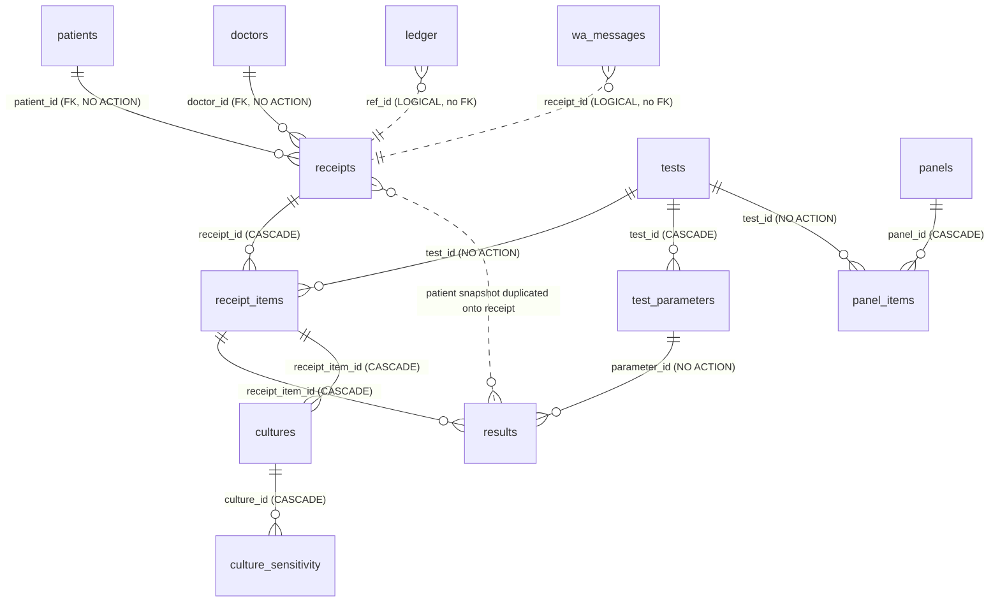

# LabDesk — Database & Data-Engineering Review (Agent_Database)

**Scope:** `src/labdesk/schema.sql` + `src/labdesk/db/*` (connection, queries, _config,
backup, audit, auth, settings, patient_id, crypto, paths, _driver) and every SQL call
site in `ui/`, `services/`, `report/`, `render/`.
**Method:** static read of schema/DDL + migrations, index inventory against actual
WHERE/JOIN/ORDER columns, transaction & locking review, N+1 / scan detection, backup
& restore-integrity review. Read-only — no files changed outside `audit/`.

**Headline grade: B−**

The schema is well thought-out for a single-site desktop LIS: encrypted-at-rest
(SQLCipher), WAL + `busy_timeout`, FK-on, sensible snapshotting of history onto
receipts, a tamper-evident audit chain, fail-closed encryption, and a clean
additive-migration story. It is held back from an A by: **declarative foreign keys
that are never indexed** (every `JOIN ... ON child.fk = parent.id` and every
`DELETE ... ON DELETE CASCADE` does a full child-table scan), several **real N+1
loops** on the two hottest paths (result entry and report rendering), **no `ANALYZE`**
(the planner runs blind), **REAL money columns**, and a **lab-number allocation that
is not race-safe across processes** despite the unique guard.

---

## 1. Table inventory

| Table | PK | Purpose | Row growth | Notes |
|---|---|---|---|---|
| `settings` | `key` (TEXT) | KV store for branding/config | tiny | autoindex on key — fine |
| `users` | `id` | login accounts | tiny | `username` UNIQUE; scrypt hashes |
| `doctors` | `id` | referring doctors | small | no index on `name`/`active` |
| `report_heads` | `id` | report section titles | tiny | `name` UNIQUE |
| `tests` | `id` | test catalog | small (100s) | `ix_tests_name`, `ix_tests_legacy` |
| `test_parameters` | `id` | report-line definitions | small–mid | `ix_param_test(test_id,seq)` |
| `result_templates` | `id` | result pick-lists | small | no index (small, OK) |
| `patients` | `id` | patient master | **grows** | `ix_patients_name`, +tel/mr at runtime |
| `receipts` | `id` | one visit/invoice | **grows fast** | many indexes; **FK cols unindexed** |
| `receipt_items` | `id` | line items | **grows fast** | `ix_items_receipt`, +`ix_items_test` runtime; **`test_id` FK** |
| `results` | `id` | one row per parameter per item | **grows fastest** | `ix_results_item`, UNIQUE(item,param), +`ix_results_param` runtime |
| `cultures` | `id` | microbiology main | small | **`receipt_item_id` FK unindexed** |
| `culture_sensitivity` | `id` | antibiogram | small | **`culture_id` FK unindexed** |
| `micro_lists` | `id` | micro dropdowns | tiny | `kind` queried, unindexed |
| `medicines` | `id` | inventory | small | — |
| `expenses` | `id` | expense ledger | grows | +`ix_expenses_date` runtime |
| `ledger` | `id` | income/expense/dues | grows fast | +`ix_ledger_date` runtime; `ref_id` unindexed |
| `audit_log` | `id` | tamper-evident trail | grows fast | +`ix_audit_at` runtime; hash chain |
| `wa_messages` | `id` | WhatsApp delivery log | grows | `ix_wa_messages_at` |
| `panels` | `id` | named test bundles | tiny | — |
| `panel_items` | `id` | panel↔test | small | `ix_panel_items(panel_id)`; **`test_id` FK unindexed** |

22 tables. DDL lives in `schema.sql` (idempotent `CREATE TABLE IF NOT EXISTS`), with
post-v1 column additions in `_config._EXTRA_COLUMNS` applied by
`connection._ensure_columns`, and hot-path indexes in `connection._ensure_indexes`.

## 2. Relations (ERD)

Declared FKs are sound and `PRAGMA foreign_keys = ON` is set on every connection
(`schema.sql:6`, `connection.py:143`). `ledger.ref_id` and `wa_messages.receipt_id`
are **logical references with no FK constraint** — acceptable (ref_id is polymorphic:
receipt id *or* expense id), but it means a deleted receipt can orphan ledger rows
silently. Money integrity here rests entirely on application code.

## 3. Strengths (credit where due)

- **Encryption fail-closed & verified.** `connect()` applies the SQLCipher key
  *before* any other statement (`_apply_key`, `connection.py:140`), then proves the
  cipher is engaged via `PRAGMA cipher_version` (`_assert_cipher_active`,
  `connection.py:48–64`). `_require_encryption` refuses to open in cleartext unless
  `LABDESK_ALLOW_PLAINTEXT=1`.
- **Sane PRAGMAs:** `journal_mode=WAL`, `synchronous=NORMAL`, `busy_timeout=8000`,
  `temp_store=MEMORY`, `foreign_keys=ON` (`connection.py:143–152`). WAL + NORMAL is the
  correct crash-safe/perf trade for a desktop app.
- **History is snapshotted onto `receipts` / `receipt_items` / `results`** (patient
  name/age/sex, test_name, ref_text, units). Editing a patient or a test never
  rewrites a past report. This is the single most important design decision for a LIS
  and it was done correctly (`schema.sql:136–143, 171, 186–195`).
- **Additive-only catalog sync** (`_sync_catalog_from_seed`, `connection.py:307–365`):
  an app update can add tests but never overwrites a price/range the lab edited.
- **Tamper-evident audit chain** (SHA-256 rolling hash, `audit.py`) with a file
  fallback so a DB write failure leaves a visible gap rather than a silent hole.
- **Restore safety:** `restore_db` validates the source actually opens with the key
  and has a non-empty `users` table, takes a timestamped pre-restore safety copy, and
  drops `-wal`/`-shm` sidecars (`backup.py:175–212`). `migrate_plaintext_to_encrypted`
  is atomic via `os.replace` and verifies before swapping.
- **No SQL injection.** Every call site uses bound `?` parameters. The only
  string-built SQL (`PRAGMA key`, the `conds`/`NOT_VOIDED`/column-list fragments in
  `content.py`, `connection.py` catalog sync) interpolates **constants or
  SQL-escaped passphrases**, never user data. Verified by grep across the tree.

## 4. Findings (most severe first)

### H-1 — Foreign-key columns are not indexed (scans + slow cascades)
**Location:** `schema.sql` (all FK columns) vs `connection.py:382–391`.
SQLite does **not** auto-index FK columns. Indexes that *do* exist cover only the
"parent-side" lookups. The following FK columns are queried/joined/cascaded but have
**no index**:

- `receipts.patient_id` — joined in cumulative history (`content.py:128`) and filtered
  in `reception.py:443` (`WHERE patient_id=?`). Full scan of `receipts`.
- `receipts.doctor_id` — FK, no index (lower traffic).
- `cultures.receipt_item_id` — FK with `ON DELETE CASCADE`; deleting a receipt scans
  `cultures` per item. Also joined in `verify.py:64`.
- `culture_sensitivity.culture_id` — FK + CASCADE, queried in `verify.py`/microbiology.
- `panel_items.test_id` — FK, joined in `panel_tests` (`queries.py:26`).
- `ledger.ref_id` — logical FK, no index.
- `results.parameter_id` — has runtime `ix_results_param`, **good**; but it only
  exists if `_ensure_indexes` ran (fine on every launch).

On a desktop with thousands of receipts/results these are O(n) scans that the WAL
single-writer model makes worse (a long scan under the write lock stalls other
terminals). **Recommendation:** add the FK-column indexes in §6.

### H-2 — N+1 query loops on the two hottest paths
**Locations:**
- **Result entry** — `ui/worklist.py:_build_test_block` (lines ~326–340): for *each*
  receipt item it runs `SELECT * FROM test_parameters WHERE test_id=?` **and** a
  separate `SELECT ... FROM results WHERE receipt_item_id=?`. A panel of 10 tests = 20+
  round-trips per receipt load.
- **Report rendering** — `render/report_doc.py:520` and `report/html.py:192`:
  `tc = SELECT is_culture FROM tests WHERE id=?` is executed **once per receipt item**
  inside the layout loop, when `is_culture` could be JOINed in the single
  `receipt_items` fetch (exactly as `worklist.py:276` already does:
  `SELECT ri.*, t.is_culture ... JOIN tests t`).
- **Cumulative history** — `report/content.py:134`: a `SELECT ... FROM results WHERE
  receipt_item_id=?` per prior visit (bounded to ≤8, tolerable but still N+1).

These don't crash anything but they multiply latency under the WAL single-writer lock
and on encrypted pages (every query re-derives nothing but still pays AES page costs).
**Recommendation:** batch with a JOIN or a single `WHERE receipt_item_id IN (...)`.

### M-3 — Lab-number allocation is not race-safe across processes
**Location:** `ui/reception.py:743–767`.
`MAX(CAST(substr(lab_no,...)))` is read, then a candidate is `UPDATE`d, relying on the
`ux_receipts_labno` unique partial index (`connection.py:390`) to reject collisions and
retry (`bump`). This works *within* one connection, but the read→update is **not in an
`IMMEDIATE` transaction**, and the whole `connect()` layer uses SQLite's default
**autocommit/deferred** isolation. Two terminals can both read the same `MAX`, both
attempt the same candidate; one wins on the UNIQUE guard, the loser retries — correct,
but the retry storm (`range(500)`) and the lack of an upfront write lock make this
fragile and a latent hotspot. The unique index *does* prevent duplicate lab numbers
(good), so this is a correctness-OK / robustness concern.
**Recommendation:** wrap allocation in `BEGIN IMMEDIATE` so the writer lock is taken
before the `MAX` read; collapse the 500-iteration retry.

### M-4 — No `ANALYZE` / `PRAGMA optimize`; planner runs without statistics
**Location:** `connection.py` (absent). There is no `ANALYZE`, no
`sqlite_stat1`, and no `PRAGMA optimize` on close. With several composite/partial
indexes (`ix_param_test(test_id,seq)`, `ux_receipts_labno ... WHERE lab_no IS NOT
NULL`) the planner's default heuristics can pick a suboptimal index or a scan.
**Recommendation:** run `PRAGMA optimize` on connection close (cheap, idempotent) or
`ANALYZE` after the catalog sync.

### M-5 — Money stored as `REAL` (binary float)
**Location:** `schema.sql:148–153, 251, 260–261, 238` (`subtotal, discount_pct, less,
net_amount, paid, due, amount, debit, credit, charges, price`). The code defensively
`round(...,2)` on writes (`queries.py:92–93`) and `>0.005` for the dues filter
(`accounts.py:285`), which signals the author already feels the float pain. Floating
point can't represent 0.10 exactly; summed ledgers can drift by sub-cent amounts that
accumulate across thousands of rows and won't reconcile to the penny.
**Recommendation:** store money as INTEGER minor units (paisa) or TEXT decimal; at
minimum, keep the `round()` discipline everywhere and never `SUM()` REAL money without
rounding the aggregate.

### M-6 — `date(received_at) BETWEEN ?` and `date()`-wrapped filters defeat indexes
**Location:** `ui/accounts.py:121,143`. `WHERE ... date(received_at) BETWEEN ? AND ?`
wraps the indexed column in a function, so `ix_receipts_date` **cannot** be used — full
scan of `receipts`. The codebase already knows the fix: `_config.RECEIVED_TODAY`
(`_config.py:144`) deliberately uses a half-open range to stay sargable. The accounts
date-range queries should use the same pattern.
**Recommendation:** rewrite as `received_at >= ? AND received_at < date(?, '+1 day')`.

### M-7 — Backup uses `sqlite3.connect(src)` and re-keys — but bypasses the live WAL
**Location:** `backup.py:_encrypted_copy` / `backup_db` (lines 16–29, 105–117). The
online backup API (`sc.backup(dc)`) is correct and copies a consistent snapshot. But
it opens a **fresh** connection to the live file rather than reusing the app's
connection; with WAL, a separate reader sees committed data only after the writer's
last commit (fine), yet there is no `wal_checkpoint` before backup, so a long-lived WAL
can mean the backup reflects an older checkpoint boundary. In practice acceptable, but
`restore_db` deletes `-wal/-shm` after a raw `shutil.copyfile` (`backup.py:204–208`),
which assumes the source has no uncheckpointed WAL — true for backup outputs, but a
foot-gun if a raw live file is ever passed.
**Recommendation:** checkpoint (`PRAGMA wal_checkpoint(TRUNCATE)`) before
backup/restore source reads; document that restore inputs must be checkpointed copies.

### L-8 — `doctors`, `micro_lists`, `result_templates` lack supporting indexes
`doctors` is searched by `name LIKE`/`active` (`ui/doctors.py:131`); `micro_lists` by
`kind` (`ui/microbiology.py:145,218`). Tables are small so scans are cheap today, but
`micro_lists(kind)` and `doctors(active)` are trivial wins.

### L-9 — `discount_pct` typed as a money REAL with `DEFAULT 0`, and `case_no` duplicates `lab_no`
**Location:** `reception.py:760` sets `case_no = lab_no` (same value into two columns).
`case_no` is a post-v1 column (`_config.py:104`) that is always equal to `lab_no` —
redundant storage. Minor normalization smell; not harmful.

### L-10 — Redundant / overlapping index potential
`results` has both `ix_results_item(receipt_item_id)` and the UNIQUE
`(receipt_item_id, parameter_id)` autoindex. The UNIQUE index's leading column is
`receipt_item_id`, so it can serve `WHERE receipt_item_id=?` lookups —
`ix_results_item` is **redundant** with the UNIQUE index and can be dropped (saves
write amplification on the hottest table). Same logic: confirm before dropping, but
the leading-column rule makes `ix_results_item` superfluous.

### Info — Good practices observed
- `PRAGMA can't be parameterised` correctly handled with SQL-escaping for the key
  (`connection.py:88–93`), injection-safe.
- `set_settings` batches a whole form into one transaction (`settings.py:27–39`) —
  fixed a real "30 fsyncs froze the UI" problem. Good.
- `executemany` used for bulk settings; `INSERT OR IGNORE` / `ON CONFLICT ... DO
  UPDATE` upserts are idiomatic.
- Migrations are idempotent and column-existence-checked (`_ensure_columns`).

## 5. Transactions, locking & concurrency

- **Isolation:** default autocommit/deferred. Multi-statement writes
  (`save_panel`, `save_test_parameters`, `receive_due`, the reception save) correctly
  group work and call `con.commit()` once, with `rollback()` on error
  (`queries.py:60,99,178,186`; `reception.py:779–784`). Good discipline.
- **Locking:** WAL allows one writer + many readers; `busy_timeout=8000` lets a second
  terminal wait rather than fail. No `BEGIN IMMEDIATE` anywhere, so write-after-read
  sequences (lab-no allocation, due recovery) have a TOCTOU window the app mitigates
  with the UNIQUE guard (lab_no) or accepts (due math). See M-3.
- **Cross-process:** the app explicitly supports multiple instances sharing the DB
  (`busy_timeout` comment, `connection.py:151`). The unique partial index on `lab_no`
  is the real concurrency guard and it is correct.
- **`save_test_parameters`** does diff-based UPDATE/INSERT/DELETE inside one
  transaction with a `ParameterInUseError` rollback path that protects referential
  history (won't delete a parameter that has saved `results`) — well done
  (`queries.py:124–187`).

## 6. Index recommendations

| # | Index DDL | Why | Priority |
|---|---|---|---|
| 1 | `CREATE INDEX ix_receipts_patient ON receipts(patient_id)` | FK; `WHERE patient_id=?` (reception:443), history join | High |
| 2 | `CREATE INDEX ix_cultures_item ON cultures(receipt_item_id)` | FK + CASCADE + verify/micro joins | High |
| 3 | `CREATE INDEX ix_culsens_culture ON culture_sensitivity(culture_id)` | FK + CASCADE + antibiogram join | High |
| 4 | `CREATE INDEX ix_panel_items_test ON panel_items(test_id)` | FK; `panel_tests` join (queries:26) | Medium |
| 5 | `CREATE INDEX ix_receipts_doctor ON receipts(doctor_id)` | FK | Medium |
| 6 | `CREATE INDEX ix_ledger_ref ON ledger(ref_id)` | dues/receipt reconciliation | Medium |
| 7 | `CREATE INDEX ix_micro_lists_kind ON micro_lists(kind)` | `WHERE kind=?` (micro:145,218) | Low |
| 8 | `CREATE INDEX ix_doctors_active ON doctors(active)` | doctor pickers | Low |
| 9 | *Drop* `ix_results_item` | redundant with UNIQUE(receipt_item_id,parameter_id) leading column | Low |
| 10 | `PRAGMA optimize` on close (or `ANALYZE` post-sync) | give the planner statistics | Medium |

(All new indexes belong in `connection._ensure_indexes` so they apply to existing
installs on next launch, matching the established migration pattern.)

## 7. Backup / restore integrity — verdict

Solid. Encrypted online-backup copies, rotation, fallback-to-local-disk when the USB
is unplugged (`backup.py:57–91`), validated restore source (opens with key + non-empty
users), timestamped pre-restore safety copy, atomic plaintext→encrypted migration via
`os.replace`. The two gaps are M-7 (no pre-backup checkpoint) and the reliance on
`shutil.copyfile` for restore (raw byte copy is fine *because* sources are
checkpointed backup outputs, but undocumented as a precondition).

---

### Bottom line
Schema design, encryption posture, history snapshotting, audit chain, and migration
hygiene are genuinely strong (A-grade ideas). The drag is **operational data
engineering**: unindexed foreign keys, N+1 on the hot paths, no planner statistics,
REAL money, and a couple of non-sargable date filters. None are data-loss bugs; all
are throughput/scaling/precision issues that will bite as a busy lab's `results`/
`receipts`/`ledger` tables grow. Fixing §6 (a dozen lines in `_ensure_indexes`) and
the N+1 JOINs would move this to an A−.
